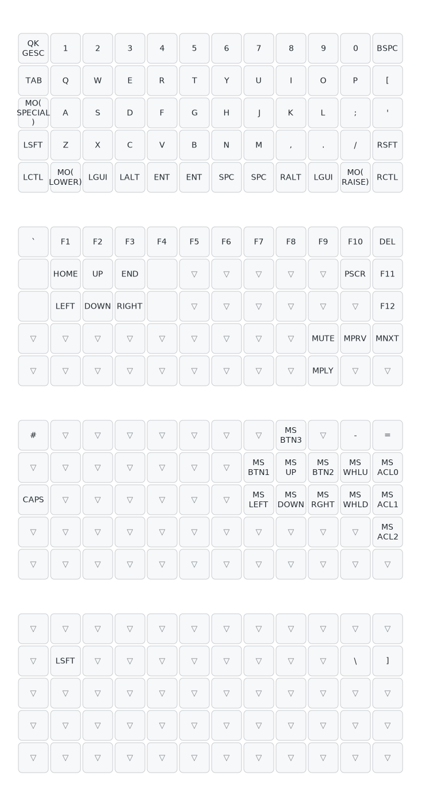

# Chameleon configuration
My personal configuration for the Chameleon keyboard. Designed by [TweetyDaBird](https://github.com/TweetyDaBird/Fat-Chameleon) ([shop](https://lectronz.com/stores/tweetys-wild-thinking)).

### Compiling and flashing

Dependencies: [`qmk`](https://github.com/qmk/qmk_firmware)

1. Create new keymap: `qmk new-keymap -kb tweetydabird/chameleon`
1. Edit the layout, the qmk command should tell you where the keymap was created ([keycodes](https://docs.qmk.fm/keycodes))
1. Compile the keymap: `qmk compile -kb tweetydabird/chameleon -km <YOUR_KEYMAP_NAME>`
1. Flash:
    1. First on the keyboard turn on the BOOTLOADER mode - unplug the keyboard, press left top button (key at [0,0] in the matrix), while holding the button plug the keyboard into the computer.
    1. Run `qmk flash -kb tweetydabird/chameleon -km <YOUR_KEYMAP_NAME>`
1. Done :-)

### Generating the layout svg

Dependencies: [`qmk`](https://github.com/qmk/qmk_firmware), [`keymap-drawer`](https://github.com/caksoylar/keymap-drawer)

1. Generate YAML of the layout: `qmk c2json keymap.c --no-cpp | keymap parse -c 10 -q - \> <FILE_NAME>.yaml`
1. Generate SVG from the YAML: `keymap draw <FILE_NAME>.yaml > _keymap.svg`

## Layout

